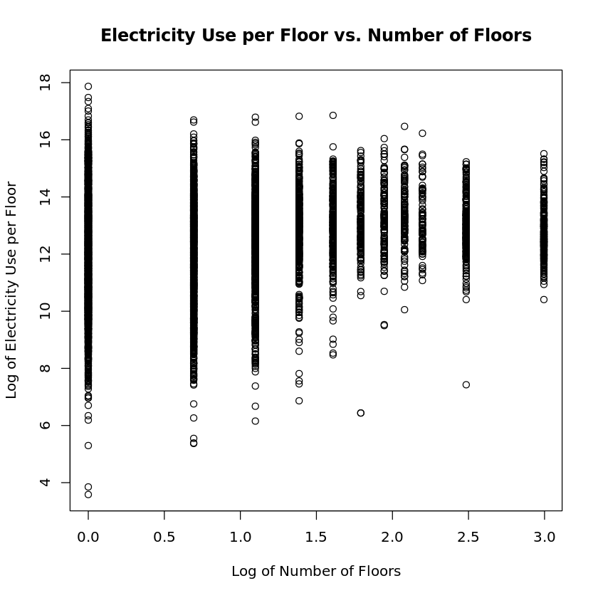
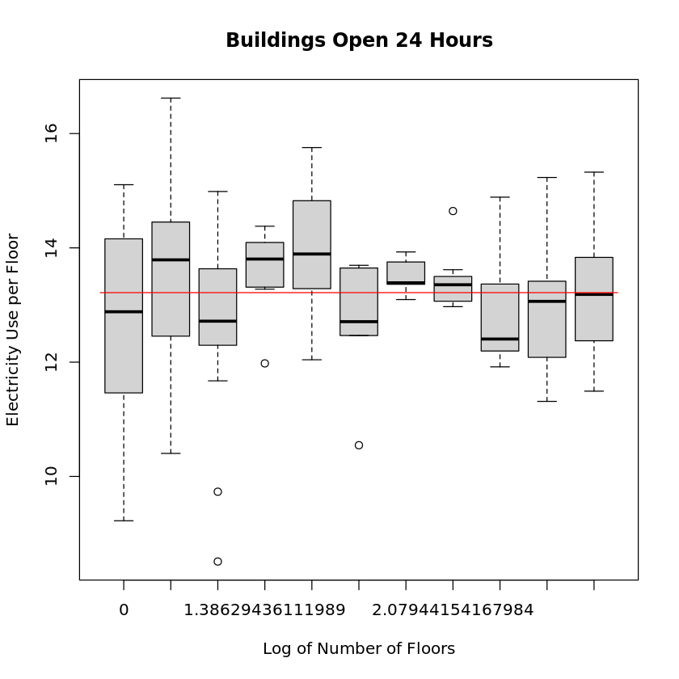

# STATS506 Project Report
Fan Zhang [zff@umich.edu](mailto:zff@umich.edu) 

GitHub Repository: [https://github.com/cajole-fff/UMich-STATS506-FanZhang/](https://github.com/cajole-fff/UMich-STATS506-FanZhang/)

## Dataset and Topic
In this project, I use the dataset [2018 Commercial Buildings Energy Consumption Survey (CBECS)](https://www.eia.gov/consumption/commercial/data/2018/index.php?view=microdata). It is a valuable resource for conducting detailed analysis of energy use in commercial buildings. The dataset contains approximately 620 survey variables and about 630 imputation flags and weighting variables. It provides comprehensive information on energy consumption, building characteristics, and other relevant data for a wide range of commercial buildings. The dataset is designed to facilitate in-depth statistical analysis and research on energy usage patterns, building features, and related factors in the commercial sector.

## Research question 
The focus of this research is to understand how the ratio of energy consumption to the number of floors (`ECNF`) in a building changes with an increase in the number of floors. Specifically, the study seeks to determine whether the per-floor energy consumption remains constant or varies with the building height, considering factors like shared heating systems.

## Summary of approach and results 

### Data Preparation
The analysis utilized the `CSV` formatted 2018 CBECS dataset, focusing on key variables like `ELUSED` (electricity used), `ELCNS` (annual electricity consumption in kWh), `NFLOOR` (number of floors), `PBA` (principal building activity) and `OPEN24` (open 24 hours a day). 

For the analysis, `NFLOOR` values were standardized: values from $1$ to $9$ remained as is, while $994$ and $995$ are reassigned to $12$ and $20$ to represent the average number of floors in the categories $10$ to $14$ and $15$ or more, respectively. To address potential multicollinearity and to facilitate the analysis, both `NFLOOR` and the `ECNF` ratio were transformed using logarithms, resulting in `lognfloor` and `logecnf`. For missing values, there isn't any if we specify `ELUSED` to be $1$, which corresponds to buildings that use electricity. 

### Simple linear regression: all building activities
To get a general idea of the relationship, I conducted a simple linear regression `lm(logecnf ~ lognfloor)`. It resulted in adjusted $R^2 = 0.03863$ and $p$-value $< 2.2e-16$, indicating significance but low overall fit. 

The plots above suggest a week or non-existent relationship between these variables, implying that other factors might also influence `ECNF`. Further analysis will explore more complex models to better capture these dynamics. 

### Simple linear regression: `PBA = OFFICE`

Focusing on `PBA = OFFICE`, the most prevalent building activity, I conducted a further analysis using simple linear regression `lm(logecnf ~ lognfloor)`. This model yielded an adjusted $R^2 = 0.1577$ and $p$-value $< 2.2e-16$, indicating significance but still a modest fit. 

Despite the low model fit, this time the plots above reveal an initial increase and subsequent stabilization in `logecnf` with increasing `lognfloor`, aligning with practical expectations. For instance, in multi-floor buildings, lower floors might aid in heating upper levels, reducing overall energy consumption per floor. This insight led to exploring an exponential decay or a Log-Logistic model for potentially better fitting the observed data pattern. 

### Log-Logistic regression: `PBA = OFFICE`

The fitting of an exponential decay model resulted in extremely small $R^2$. But for the Log-Logistic model $y = \frac{a}{1 + \exp[-b(x-c)]}$ fitted using `nlsLM`, it yielded an `R^2 = 0.1796` and $p$-value $< 2.2e-16$, indicating statistical significance. However, the relatively low $R^2$ suggests the model still does not fully capture the complexity of the data. 

### Log-Logistic regression: `PBA = OFFICE` and `OPEN24 = 2`

An additional analysis was conducted using the Log-Logistic model for buildings based on their operational hours. For buildings not open 24 hours, the model achieved an $R^2 = 0.1953$ with a significant $p$-value $< 2.2e-16$. However, for 24-hour open buildings, the model's $R^2$ was notably lower at $0.0174$, despite the significant $p$-value $< 2.2e-16$.

The plots above indicate that in 24-hour open buildings, energy consumption per floor remains relatively constant across different floor numbers. This observation aligns with the expectation that energy usage in such buildings is more consistent, likely due to continuous operation of machinery and system. 

If we reassign the outliers of `logecnf` for each floor to closest non-outlier value, we will get a little bit better fit with $R^2 = 0.2080$. 

## Conclusion and Discussion

In this study, we investigated how the energy consumption per floor (`ECNF`) varies with the number of floors (`NFLOOR`) in office buildings. Our analysis revealed that `ECNF` initially increases with `NFLOOR` but then stabilizes, suggesting a diminishing impact of additional floors on energy consumption. This pattern implies that while higher buildings may have higher overall energy use, the per-floor energy demand tends to plateau. 

One notable observation is the considerable variation of `ECNF` for buildings with fewer floors. This could be attributed to a baseline energy requirement necessary to maintain a building, regardless of its height. This baseline energy requirement is different for each building, depending on factors like size of the building, type of heating system, and so on. When the number of floors is low, this baseline requirement accounts for large part of total energy consumption. However, in taller buildings, this fixed consumption is spread across more floors, leading to a more uniform `ECNF`. 

This study's relatively low $R^2$ value indicates substantial variability in `ECNF` that our model could not fully capture. This limitation might stem from the large energy consumption variance among buildings with a small number of floors or from other unaccounted factors. Given the constraints of our dataset, further research is warranted. Acquiring more comprehensive data or employing techniques like bootstrapping could provide deeper insights into the complex dynamics of building energy use. 