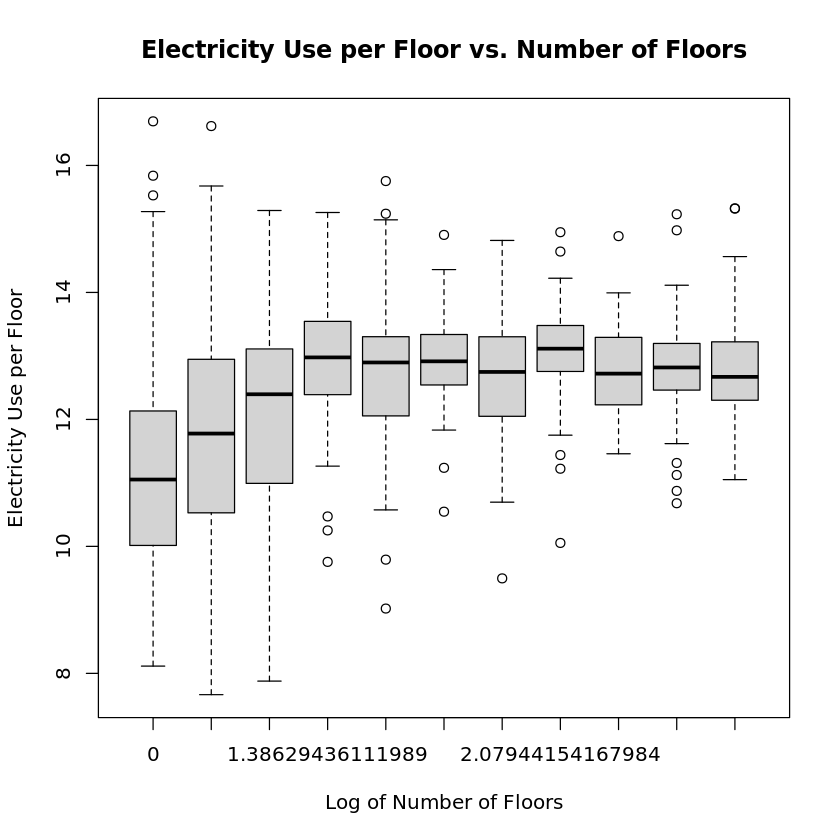

# STATS506 Project Report
Fan Zhang [zff@umich.edu](mailto:zff@umich.edu) 

## Dataset and Topic
In this project, I use the dataset [2018 Commercial Buildings Energy Consumption Survey (CBECS)](https://www.eia.gov/consumption/commercial/data/2018/index.php?view=microdata). It is a valuable resource for conducting detailed analysis of energy use in commercial buildings. The dataset contains approximately 620 survey variables and about 630 imputation flags and weighting variables. It provides comprehensive information on energy consumption, building characteristics, and other relevant data for a wide range of commercial buildings. The dataset is designed to facilitate in-depth statistical analysis and research on energy usage patterns, building features, and related factors in the commercial sector.

## Research question 
The research question I am interested in is: What does the energy consumption-number of floors ratio change as the number of floors increases?

As the number of floors increases, the energy consumption will definitely increase. But the energy consumption per floor may not increase simultaneously. For example, if the energy is mainly used for heating, the energy consumption per floor may decrease as the number of floors increases. Because the heat from the lower floors can be used to heat the upper floors. Therefore, I am interested in the relationship between the energy consumption and the number of floors.

## Summary of approach and results 

### Data Preparation
The dataset is in `CSV` format. To explore the research question, some important variables are 
- `ELUSED` Electricity used 
- `ELCNS` Building/energy supplier variable: Annual electricity consumption (kWh)
- `NFLOOR` Number of floors
- `PBA` Principal building activity
- `OPEN24` Open 24 hours a day 

For buildings with `ELUSED = 1` (i.e., buildings that use electricity), there isn't any missing value in `ELCNS` and `NFLOOR`. But for `NFLOOR`, value $1$ to $9$ are used to represent the number of floors, and value $994$ are used to represent $10 \sim 14$ and $995$ are used to represent $15$ or more. In this case, I reassign the value of $994$ to $12$, which is the average of $10 \sim 14$, and reassign the value of $995$ to $20$.

Since the variable `NFLOOR` appears in both sides of the regression equation, I use the logarithm of `NFLOOR`, `lognfloor`, to avoid the multicollinearity problem. At the same time, I calculate logarithm of the ratio of `ELCNS` and `NFLOOR` to get `logecnf`.

### Simple linear regression: all building activities

To get a general idea of the relationship, I first use simple linear regression `lm(logecnf ~ lognfloor)` to fit the model, which yields adjusted $R^2 = 0.03863$ and $p$-value $< 2.2e-16$. The result shows that the model is significant, but the adjusted $R^2$ is very low, which means the model is not a good fit.

From the scatter plot of Electricity Use per Floor vs. Number of Floors, we can see that there seems to be no relationship between the two variables. But the electricity use per floor depends on a lot of other factors. Let's see if we can get a better model by filtering out some of the factors.

### Simple linear regression: `PBA = OFFICE`

Since the dataset contains a lot of different building activities, I first filter out the buildings with `PBA = OFFICE`, which is the most common building activity. Then I use simple linear regression `lm(logecnf ~ lognfloor)` to fit the model, which yields adjusted $R^2 = 0.1577$ and $p$-value $< 2.2e-16$. The result shows that the model is significant, but the adjusted $R^2$ is still low, which means the model is not a good fit.

Interestingly, although the linear model is not a good fit, the scatter plot of Electricity Use per Floor vs. Number of Floors shows that the electricity use per floor seems to first increase and then keep constant as the number of floors increases. This is consistent with our common sense. For example, the energy consumption per floor may decrease as the number of floors increases if the energy is mainly used for heating. Because the heat from the lower floors can be used to heat the upper floors. Therefore, I am interested in fitting another Log-Logistic model to see if we can get a better fit.

### Log-Logistic regression: `PBA = OFFICE`

This time, I tried a Log-Logistic model $y = \frac{a}{1 + \exp[-b(x-c)]}$ and use `nlsLM` to fit the model. Now, we have $R^2 = 0.1796$ and $p$-value $< 2.2e-16$. The result shows that the model is significant, but the $R^2$ is still low, which means the model is not a good fit.

### Log-Logistic regression: `PBA = OFFICE` and `OPEN24 = 2`

For the buildings open 24 hours a day, the energy consumption per floor may be different from the buildings not open 24 hours a day. Intuitively, the energy consumption are mainly used to maintain the status of every machine in 24-hour buildings. On the contrary, for those not open 24-hour, large amount of energy consumption may be used to start the machines, which may lead to a higher energy consumption per floor. Therefore, I am interested in fitting another Log-Logistic model to see if we can get a better fit.

This time, I tried a Log-Logistic model again for buildings not open 24-hour and get $R^2 = 0.1953$ and $p$-value $< 2.2e-16$. On the contrary, for those buildings open 24-hour, I get $R^2 = 0.0174$ and $p$-value $< 2.2e-16$. The $R^2$ is extremely small. 

From the above two plots, we can see that the energy consumption per floor of buildings open 24-hour seems to be constant no matter how many floors the building has. This is consistent with our common sense. 

## Conclusion and Discussion

In this study, we explored the relationship between 